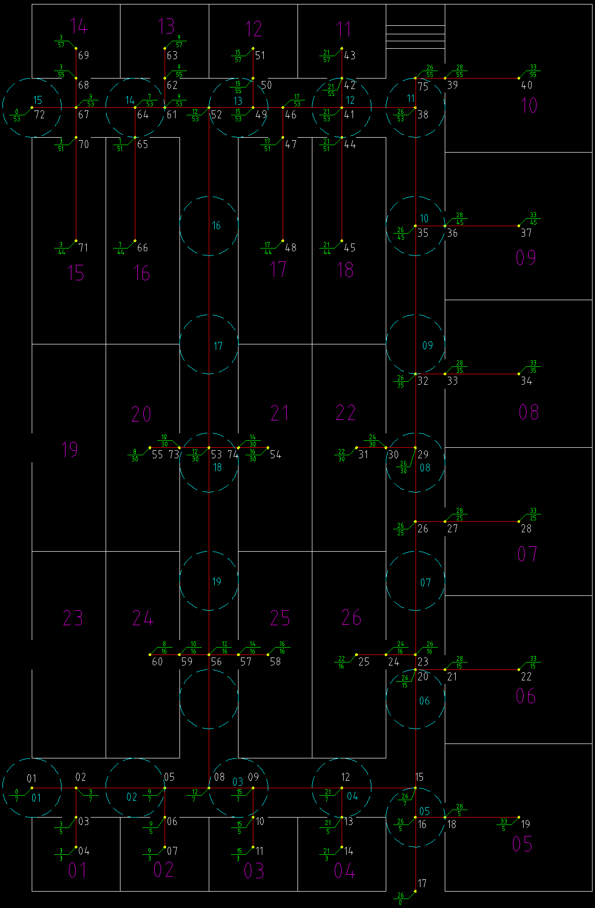

# IndoorToolKit

## Real-world trajectories
    IndoorQuery/data/realData
   We collected moving trajectories at the second floor of Auburn University Haley Center, where 30 rooms are connected to one or more hallways.
  
      
   
 Haley Center ( floorplan of 2nd floor at right )

##  Miscellaneous
   If you have any question, please contect Hui Bo (bohui@auburn.edu).
    
